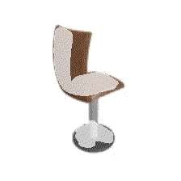
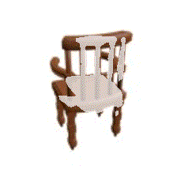
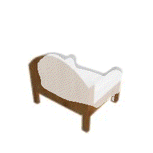
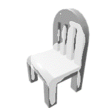
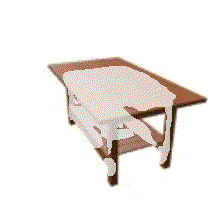
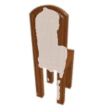
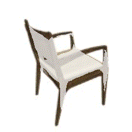

# FvOR: Robust Joint Shape and Pose Optimization for Few-view Object Reconstruction

### [Paper](http://arxiv.org/abs/2205.07763)
<br/>

## ⚙️ Installation

Our system uses CUDA10.1. Setup the environment with following commands:
```
conda create --name fvor python=3.8.0
conda activate fvor
conda install pytorch==1.7.1 torchvision==0.8.2 cudatoolkit=10.1 -c pytorch
pip install -r requirements.txt

python setup.py build_ext --inplace

cd ./src/lib/sdf_extension
python setup.py install
cd ../../../
```
## :file_folder: Download

Our ShapeNet dataset are based on Occupancy Network. Please go to [Occupancy Network](https://github.com/autonomousvision/occupancy_networks) and download their processed data. And also download and uncompress our [processed data](https://drive.google.com/file/d/1SSV-5pLUOJ0jhnIEDiTXsyzzNGkBmZB1/view?usp=sharing) and [index file](https://drive.google.com/file/d/1cSr1ycRvaT3vz7kcZ-L-Bfa6TZ6u-gb6/view?usp=sharing). 
You should make a folder structure as follows:
```
.
└── data
    └── shapenet
        ├── FvOR_ShapeNet
        │   └── 03001627
        │       └── ae02a5d77184ae2638449598167b268b
        ├── index
        │   ├── data
        │   │   └── 03001627_ae02a5d77184ae2638449598167b268b.npz
        │   ├── test.txt
        │   ├── train.txt
        │   └── val.txt
        └── ShapeNet   <- Occupancy Network's processed data
            └── 03001627
                └── ae02a5d77184ae2638449598167b268b
```
  - ShapeNet checkpoints [shape initialization](https://drive.google.com/file/d/1F2GISYytStxdBmwUIJOmnDN-dU_wbvFP/view?usp=sharing), [pose initialization](https://drive.google.com/file/d/12BF2LIdxyDVwHkITEvDZvTmtwwaA9XV0/view?usp=sharing), [joint optimization](https://drive.google.com/file/d/1bzHeZUJI-3DNUlnfbcuS6r7AbTMOIQBG/view?usp=sharing)

We also test our approach on [HM3D-ABO](https://github.com/zhenpeiyang/HM3D-ABO) dataset. Please follow the instructions in HM3D-ABO to setup the dataset. 
  - HM3D-ABO checkpoints [shape initialization](https://drive.google.com/file/d/1IuQRcXwx3bz5mBVS9WlFoRpKw5oyGrmJ/view?usp=sharing), [pose initialization](https://drive.google.com/file/d/1bvyYEOr5NrqyCSsW3UCAfsE9Zy5HOGTt/view?usp=sharing), [joint optimization](https://drive.google.com/file/d/1R0g0jUkf3uAx-P9y-YNU8DAVR-Nsttd1/view?usp=sharing)


## ⏳ ShapeNet
<details>
  <summary>Click to expand </summary>
    
### Training
First download and extract ShapeNet training data and split. Then run following command to train our model. 

#### Train Pose Init Module 
```
bash scripts/shapenet/pose_init.sh  ./configs/shapenet/config_pose_init_fvor.yaml
```
#### Train Shape Init Module 
```
bash scripts/shapenet/shape_init.sh  ./configs/shapenet/config_shape_init_fvor.yaml 
```
#### Joint Shape-and-Pose Optimization Module 
You need to first train the shape init module. Then provided that checkpoint as the initial weight for training joint shape-and-pose optimization module.
```
bash scripts/shapenet/joint.sh  ./configs/shapenet/config_joint.yaml --noise_std 0.005
```
&nbsp;
&nbsp;
&nbsp;
  
  
### Testing 
First download and extract data, split and pretrained models.


#### Shape Module 
Testing FvOR recon model trained with Ground Truth camera poses.
```
bash scripts/shapenet/test_shape_init.sh  ./configs/shapenet/config_shape_init_fvor.yaml
```

You should get following results where for each metric we show mean/median:

| classes     | IoU             | Chamfer-L1      | Normal          |
|-------------|-----------------|-----------------|-----------------|
| car         | 0.78966/0.86160 | 0.00902/0.00780 | 0.88122/0.88809 |
| bench       | 0.72131/0.74275 | 0.00459/0.00420 | 0.91949/0.93939 |
| cabinet     | 0.84035/0.91216 | 0.00670/0.00605 | 0.93675/0.94482 |
| rifle       | 0.82634/0.83985 | 0.00267/0.00240 | 0.94196/0.95006 |
| loudspeaker | 0.80380/0.85884 | 0.00970/0.00841 | 0.91553/0.93439 |
| sofa        | 0.83387/0.88555 | 0.00638/0.00547 | 0.94379/0.95480 |
| watercraft  | 0.74418/0.77834 | 0.00717/0.00630 | 0.89389/0.89511 |
| table       | 0.68933/0.71080 | 0.00631/0.00536 | 0.93191/0.94281 |
| airplane    | 0.80502/0.82466 | 0.00328/0.00256 | 0.92771/0.94142 |
| telephone   | 0.87473/0.89383 | 0.00396/0.00336 | 0.97978/0.98560 |
| lamp        | 0.68345/0.71213 | 0.00616/0.00508 | 0.90505/0.91853 |
| display     | 0.79516/0.81113 | 0.00613/0.00546 | 0.95023/0.95460 |
| chair       | 0.74117/0.75940 | 0.00615/0.00520 | 0.93033/0.94113 |
| Overall     | 0.78064/0.81470 | 0.00602/0.00520 | 0.92751/0.93775 |
  


#### Pose Module 
Testing FvOR pose estimation model.
```
bash scripts/shapenet/test_pose_init.sh ./configs/shapenet/config_pose_init_fvor.yaml
```
You should get following results:
  
| classes     | Error_Pix    | Error_Rot    | Error_Trans |
|-------------|--------------|--------------|-------------|
| display     | 3.287/0.627  | 8.448/0.928  | 0.012/0.010 |
| airplane    | 0.750/0.488  | 1.670/1.135  | 0.017/0.012 |
| sofa        | 0.832/0.466  | 1.279/0.657  | 0.011/0.008 |
| chair       | 0.727/0.532  | 1.215/0.828  | 0.012/0.009 |
| lamp        | 2.524/1.528  | 7.641/4.054  | 0.024/0.015 |
| car         | 0.530/0.444  | 0.830/0.699  | 0.010/0.009 |
| cabinet     | 0.707/0.301  | 1.486/0.430  | 0.006/0.004 |
| watercraft  | 0.969/0.771  | 2.290/1.669  | 0.020/0.017 |
| rifle       | 1.528/0.550  | 4.452/1.609  | 0.023/0.018 |
| loudspeaker | 3.279/0.833  | 6.461/1.426  | 0.019/0.011 |
| bench       | 0.724/0.406  | 1.371/0.695  | 0.010/0.008 |
| table       | 1.172/0.348  | 2.067/0.447  | 0.009/0.005 |
| telephone   | 1.220/0.433  | 3.700/0.885  | 0.010/0.008 |
| Overall     | 1.404/0.594  | 3.301/1.189  | 0.014/0.010 |
  

#### Joint Shape-and-Pose Optimization Module 

Testing FvOR full model with noisy input pose with different noise magnitude.
```
bash scripts/shapenet/test_joint.sh ./configs/shapenet/test_config_joint.yaml --noise_std 0.005
```
We use noise_std = {0.0025, 0.005, 0.0075} in our paper experiments. Such evaluation takes around 4 hours with 4 NVIDIA V100 GPUs. When finish, you should see several tables. The first table list the final metrics after 3 alternation steps. Then there will be tables listing per-step metrics.  
 
You should get something like these if you run with --noise_std 0.005


| classes     | IoU             | ChamferL1       | Normal             |
|-------------|-----------------|-----------------|--------------------|
| sofa        | 0.82785/0.88003 | 0.00710/0.00603 | 0.93701/0.94966    |
| watercraft  | 0.72476/0.79181 | 0.00854/0.00719 | 0.87260/0.88030    |
| table       | 0.69154/0.71308 | 0.00738/0.00559 | 0.91906/0.93406    |
| cabinet     | 0.85904/0.91508 | 0.00805/0.00668 | 0.92446/0.92311    |
| bench       | 0.67623/0.68392 | 0.00547/0.00505 | 0.89604/0.91215    |
| car         | 0.79223/0.87456 | 0.00951/0.00836 | 0.87503/0.88206    |
| chair       | 0.72057/0.74591 | 0.00737/0.00615 | 0.91392/0.92637    |
| lamp        | 0.63754/0.69163 | 0.00974/0.00769 | 0.86965/0.88945    |
| airplane    | 0.75356/0.77604 | 0.00474/0.00350 | 0.90310/0.92717    |
| display     | 0.79926/0.80117 | 0.00704/0.00601 | 0.93633/0.93791    |
| rifle       | 0.78764/0.80378 | 0.00386/0.00312 | 0.92098/0.93473    |
| loudspeaker | 0.80257/0.84934 | 0.01219/0.00932 | 0.90700/0.91931    |
| telephone   | 0.89708/0.91087 | 0.00382/0.00342 | 0.97793/0.98349    |
| Overall     | 0.76691/0.80286 | 0.00729/0.00601 | 0.91178/0.92306    |

 IoU
| classes     | step0           | step1           | step2           | step3           |
|-------------|-----------------|-----------------|-----------------|-----------------|
| sofa        | 0.75881/0.80133 | 0.81876/0.87326 | 0.82566/0.87720 | 0.82785/0.88003 |
| watercraft  | 0.64152/0.69056 | 0.71531/0.78423 | 0.72171/0.78917 | 0.72476/0.79181 |
| table       | 0.56633/0.58933 | 0.67476/0.68843 | 0.69061/0.70933 | 0.69154/0.71308 |
| cabinet     | 0.81327/0.85720 | 0.85581/0.91572 | 0.85816/0.91513 | 0.85904/0.91508 |
| bench       | 0.49186/0.52049 | 0.64679/0.66114 | 0.67004/0.68966 | 0.67623/0.68392 |
| car         | 0.74156/0.80633 | 0.78504/0.86113 | 0.79069/0.87262 | 0.79223/0.87456 |
| chair       | 0.57205/0.60851 | 0.68814/0.71468 | 0.71386/0.74174 | 0.72057/0.74591 |
| lamp        | 0.48011/0.49397 | 0.60173/0.64573 | 0.63038/0.68511 | 0.63754/0.69163 |
| airplane    | 0.53660/0.54194 | 0.69903/0.73453 | 0.73847/0.76738 | 0.75356/0.77604 |
| display     | 0.70697/0.77447 | 0.78866/0.79659 | 0.79729/0.80047 | 0.79926/0.80117 |
| rifle       | 0.53468/0.56082 | 0.72926/0.75873 | 0.78132/0.79721 | 0.78764/0.80378 |
| loudspeaker | 0.76775/0.82162 | 0.80123/0.84619 | 0.80194/0.84275 | 0.80257/0.84934 |
| telephone   | 0.75342/0.79107 | 0.88990/0.90237 | 0.89519/0.90588 | 0.89708/0.91087 |
| Overall     | 0.64346/0.68136 | 0.74572/0.78329 | 0.76272/0.79951 | 0.76691/0.80286 |

There will be also several other per-step tables like the IoU table above. And you can check the visualizations in *test_results* folder.  

Test FvOR full model with predicted pose
```
bash scripts/shapenet/test_joint.sh ./configs/shapenet/test_config_joint.yaml --use_predicted_pose
```
Note that you need to first generate the predicted pose by running test command of FvOR pose module.

Test FvOR full model with G.T. pose
```
bash scripts/shapenet/test_joint.sh ./configs/shapenet/test_config_joint.yaml --use_gt_pose
```
    
</details>

## ⏳ HM3D-ABO
<details>
  <summary>Click to expand </summary>


### Training 
First setup the HM3D-ABO dataset. Then run following command to train our model. 

#### Train Pose Init Module 
```
bash scripts/HM3D_ABO/pose_init.sh  ./configs/HM3D_ABO/config_pose_init_fvor.yaml
```
#### Train Shape Init Module 
```
bash scripts/HM3D_ABO/shape_init.sh  ./configs/HM3D_ABO/config_shape_init_fvor.yaml 
```
#### Joint Shape-and-Pose Optimization Module 
You need to first train the shape init module. Then provided that checkpoint as the initial weight for training joint shape-and-pose optimization module.
```
bash scripts/HM3D_ABO/joint.sh  ./configs/HM3D_ABO/config_joint.yaml --noise_std 0.005
```
&nbsp;
&nbsp;
&nbsp;
  
    
### Testing 
Please download the checkpoints for HM3D-ABO datasets and put them under this directory.
#### Shape Module 
Testing FvOR recon model trained with Ground Truth camera poses.
    
```
bash scripts/hm3d_abo/test_shape_init.sh  ./configs/hm3d_abo/config_shape_init_fvor.yaml
```
You should get following results where for each metric we show mean/median:
    

| classes  | IoU             | ChamferL1       | Normal          |
|----------|-----------------|-----------------|-----------------|
| HM3D_ABO | 0.85517/0.88380 | 0.00848/0.00747 | 0.94955/0.95803 |
| Overall  | 0.85517/0.88380 | 0.00848/0.00747 | 0.94955/0.95803 |


#### Pose Module 
Testing FvOR pose estimation model.
```
bash scripts/HM3D_ABO/test_pose_init.sh ./configs/HM3D_ABO/config_pose_init_fvor.yaml
```
You should get following results:

| classes  | Error_Pix    | Error_Rot    | Error_Trans |
|----------|--------------|--------------|-------------|
| HM3D_ABO | 17.968/5.015 | 14.344/1.331 | 0.076/0.050 |
| Overall  | 17.968/5.015 | 14.344/1.331 | 0.076/0.050 |

    
#### Joint Shape-and-Pose Optimization Module 

Testing FvOR full model with noisy input pose with different noise magnitude.
```
bash scripts/HM3D_ABO/test_joint.sh ./configs/HM3D_ABO/test_config_joint.yaml --noise_std 0.005
```
You should get something like these if you run with --noise_std 0.005

| classes  | IoU             | ChamferL1       | Normal          |
|----------|-----------------|-----------------|-----------------|
| HM3D_ABO | 0.84931/0.88010 | 0.00980/0.00843 | 0.93698/0.94923 |
| Overall  | 0.84931/0.88010 | 0.00980/0.00843 | 0.93698/0.94923 |

    

IoU
| classes  | step0           | step1           | step2           | step3           |
|----------|-----------------|-----------------|-----------------|-----------------|
| HM3D_ABO | 0.81886/0.86384 | 0.84796/0.87997 | 0.84956/0.88023 | 0.84931/0.88010 |
| Overall  | 0.81886/0.86384 | 0.84796/0.87997 | 0.84956/0.88023 | 0.84931/0.88010 |


There will be also several other per-step tables like the IoU table above. And you can check the visualizations in *test_results* folder.   
    
Test FvOR full model with predicted pose
```
bash scripts/HM3D_ABO/test_joint.sh ./configs/HM3D_ABO/test_config_joint.yaml --use_predicted_pose
```
Note that you need to first generate the predicted pose by running test command of FvOR pose module.

Test FvOR full model with G.T. pose
```
bash scripts/HM3D_ABO/test_joint.sh ./configs/HM3D_ABO/test_config_joint.yaml --use_gt_pose
```
    
</details>

### Acknowledgement
We thank the awesome codes from [LoFTR](https://github.com/zju3dv/LoFTR), [Occupancy Networks](https://github.com/autonomousvision/occupancy_networks), [BARF](https://github.com/chenhsuanlin/bundle-adjusting-NeRF), and [IDR](https://github.com/lioryariv/idr).

